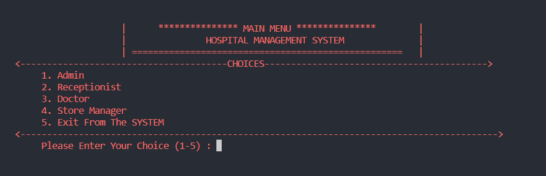
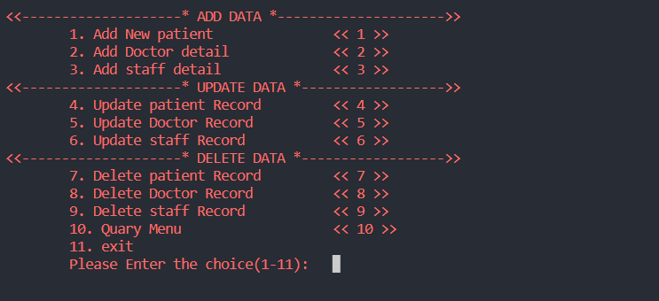
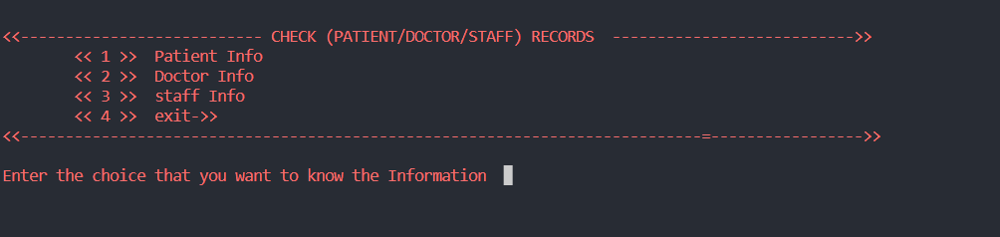
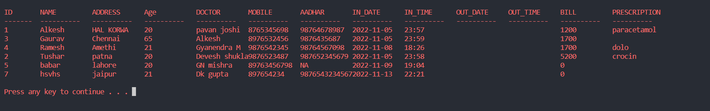
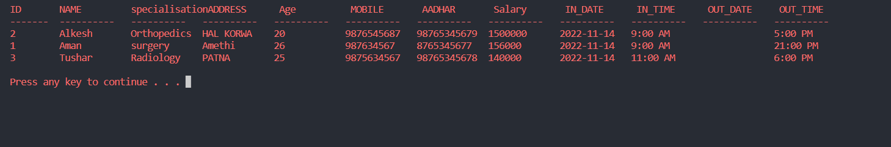

# 🏥 Hospital Management System - OOP & SQL Project

<div align="center">


*A comprehensive C++ based Hospital Management System showcasing Object-Oriented Programming (OOP) and SQL Database Management*

[📋 Features](#-features) • [🚀 Installation](#-installation) • [💻 Usage](#-usage) • [📁 Project Structure](#-project-structure) • [📸 Screenshots](#-screenshots)

</div>

---

## 📖 Project Overview

The **Hospital Management System** is a robust, feature-rich application designed to streamline operations in hospitals, clinics, and dispensaries. This project serves as a comprehensive demonstration of **Object-Oriented Programming (OOP)** concepts and **SQL Database Management** using C++ and SQLite3. Built using modern C++ with OOP principles, this system enhances administration, control, and patient care while maintaining strict cost control and improving overall profitability.

### 🎯 Key Objectives
- ✅ Digitize hospital records and reduce paperwork
- ✅ Automate patient admission/discharge processes  
- ✅ Streamline doctor and staff management
- ✅ Provide transparent billing and pharmacy management
- ✅ Ensure secure access and data privacy

---

## ✨ Features

### 👥 **Patient Management**
- 📝 Complete patient registration and admission records
- 🆔 Unique patient ID generation and tracking
- 🛏️ Bed availability and allocation management
- 📊 Patient history and medical records

### 👨‍⚕️ **Doctor Management**
- 👤 Doctor profile and specialization tracking
- ⏰ Availability and scheduling management
- 💰 Fee structure and billing integration
- 🔍 Advanced search and filtering capabilities

### 👷 **Staff Management**
- 📋 Comprehensive staff record keeping
- 📈 Performance and attendance tracking
- 🔄 Past, present, and future record management
- 🎯 Role-based access control

### 💊 **Medical Store & Billing**
- 💰 Automated expense calculation
- 💳 Transparent billing system
- 🏥 Medicine inventory management
- 📊 Financial reporting and analytics

### 🔐 **Security Features**
- 🛡️ Role-based authentication
- 🔒 Secure data access controls
- 👤 Admin and receptionist access levels
- 🔐 Password-protected system access

---

## 🛠️ Technologies Used

| Technology | Purpose | Version |
|------------|---------|---------|
| **C++** | Core Programming Language | C++11+ |
| **SQLite3** | SQL Database Management | Latest |
| **OOP (Object-Oriented Programming)** | Design Pattern & Architecture | Classes & Objects |
| **SQL** | Database Query Language | SQLite3 |
| **Visual Studio Code** | Development Environment | Latest |

### 🎓 **Educational Focus**
This project emphasizes:
- **OOP Concepts**: Encapsulation, Inheritance, Polymorphism, Abstraction
- **SQL Operations**: CRUD operations, Database Design, Query Optimization
- **Software Engineering**: Modular Design, Code Organization, Best Practices

---

## 🚀 Installation

### Prerequisites
- C++ Compiler (GCC, Clang, or MSVC)
- SQLite3 Development Libraries
- Code Editor (VS Code recommended)

### Step-by-Step Setup

1. **📥 Clone the Repository**
   ```bash
   git clone https://github.com/shuklaAlkesh/Hospital-Management-system-C--oops-project.git
   cd Hospital-Management-system-C--oops-project
   ```

2. **🗄️ Database Setup**
   - SQLite3 databases are included in the project
   - No additional database setup required
   - Databases: `HMS.db`, `AJAX HMS_Doc.db`, `AJAX HMS_staff.db`

3. **🔨 Compilation**
   ```bash
   # Using GCC
   g++ -o hms main.cpp -lsqlite3
   
   # Using Clang
   clang++ -o hms main.cpp -lsqlite3
   ```

4. **▶️ Run the Application**
   ```bash
   ./hms        # Linux/Mac
   hms.exe      # Windows
   ```

---

## 💻 Usage

### 🎮 Main Menu Options

| Option | Function | Description |
|--------|----------|-------------|
| **1-3** | ➕ **Add Data** | Add new patients, doctors, or staff |
| **4-6** | ✏️ **Update Data** | Modify existing records |
| **7-9** | 🗑️ **Delete Data** | Remove records from system |
| **10** | 🔍 **Query Menu** | Search and view records |
| **11-12** | 💊 **Store Management** | Medical store operations |

### 🔐 Access Control
- **Administrator Access**: Full system control
- **Receptionist Access**: Limited to patient and basic operations
- **Secure Login**: Username and password authentication

---

## 📁 Project Structure

```
Hospital-Management-System/
├── 📄 main.cpp                 # Main application entry point
├── 👥 patient.cpp              # Patient management module
├── 👨‍⚕️ doctor_detail.cpp        # Doctor management module
├── 👷 staff.cpp                # Staff management module
├── ➕ addpatient.cpp           # Patient addition functionality
├── ➕ addDoctor.cpp            # Doctor addition functionality
├── ➕ add_staff.cpp            # Staff addition functionality
├── ✏️ update.cpp               # Record update functionality
├── 🗑️ deleteRecord.cpp         # Record deletion functionality
├── 🔍 query_exec.cpp           # Database query execution
├── 💊 medical_store.cpp        # Medical store management
├── 🧮 calculate_patient_charge.cpp # Billing calculations
├── 🗄️ *.db files              # SQLite database files
└── 📸 image/                   # Screenshots and documentation
```

---

## 📸 Screenshots

<div align="center">

| Main Menu | Patient Management | Doctor Management |
|-----------|-------------------|-------------------|
|  |  |  |

| Staff Management | Medical Store | Billing System |
|------------------|---------------|----------------|
|  |  |  |

</div>

---

## 🎯 Expected Outcomes

### 📈 **Efficiency Improvements**
- ⚡ 70% reduction in paperwork
- 🎯 90% accuracy in record keeping
- ⏱️ 50% faster patient processing
- 💰 30% improvement in billing accuracy

### 🔄 **Automated Processes**
- 🤖 Patient admission/discharge automation
- 📅 Doctor scheduling and availability
- 💊 Medicine inventory tracking
- 📊 Financial reporting and analytics

---

## 🤝 Contributing

We welcome contributions! Please follow these steps:

1. 🍴 Fork the repository
2. 🌿 Create a feature branch (`git checkout -b feature/AmazingFeature`)
3. 💾 Commit your changes (`git commit -m 'Add some AmazingFeature'`)
4. 📤 Push to the branch (`git push origin feature/AmazingFeature`)
5. 🔄 Open a Pull Request

---

## 📜 License

This project is licensed under the MIT License - see the [LICENSE](LICENSE) file for details.

---

## 👨‍🏫 Academic Information

**Course**: Object-Oriented Programming (OOP)  
**Focus Areas**: OOP Concepts & SQL Database Management  
**Institution**: Indian Institute of Information Technology, Sri City  
**Instructor**: Dr. Pavan Kumar BN  
**Project Type**: Academic Project - OOP & SQL Integration

### 📚 **Learning Outcomes**
- Mastery of Object-Oriented Programming principles in C++
- Hands-on experience with SQL database operations
- Integration of OOP design patterns with database management
- Real-world application development using modern software engineering practices

---

## 📞 Support

If you have any questions or need help with the project:

- 📧 Create an issue on GitHub
- 💬 Contact the development team
- 📖 Check the documentation

---

<div align="center">

**⭐ Star this repository if you found it helpful!**

Made with ❤️ by the Hospital Management System Team

</div>
